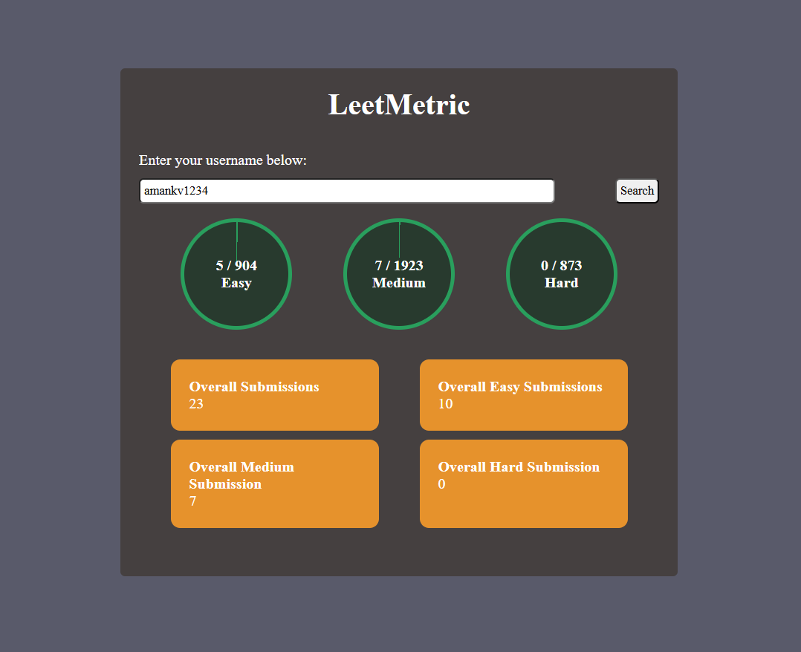

# LeetMatric

🚀 A web app that shows **LeetCode user statistics** by entering a valid username.  
It displays:
- ✅ Total problems solved
- 🟢 Easy solved
- 🟡 Medium solved
- 🔴 Hard solved

## 📸 Preview

## 🔧 Tech Stack
- HTML, CSS, JavaScript
- LeetCode API

## 🌐 Live Demo
[Click here](https://amankv1234.github.io/LEET_MATRIC_APP/)

## 📌 How to Use
1. Enter your LeetCode username.
2. Click search.
3. View your stats instantly!  how to add screen shot
